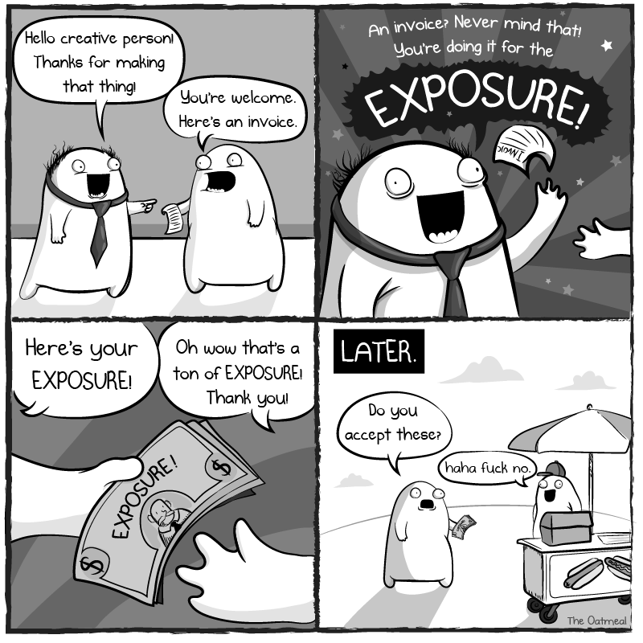

build-lists: true
slide-transition: true

# Getting and Maintaining   a Side Hustle

---

# 👋 Hi, I'm Tim

- Work at New Story - [newstorycharity.org](https://newstorycharity.org)
- Helped launch a code school
- Wrote Code School Book - [codeschoolbook.com](https://codeschoolbook.com)
- Coding since 2003
- Enjoy Scotch and Synthwave

---

# 🤔 Who are you?

- You are in, about to be in or recently graduated from a code school
- You enjoy writing code and building things
- You have some extra free time

---

## Why Do You Want a Side Hustle?

- Extra Income
- Learn a new skill
- You're Bored
- None of your business

^ Your reason matters. It will determine some of the next steps.

---

## Types of Side Hustles

- Development (Freelance Work)
- Building your own app
- Writing an E-Book
- Tutoring or Mentoring
- Creating Video Tutorials (YouTube)
- Creating Digital Assets (Themeforest, Creative Market)

^ Assuming most of you are developers or interested in coding in some way, you might lean first towards building something. That's what I've done, but is it the best option for you? 

^ Which ones fit within your schedule? Are you looking for a quick fix ($$$) or a long term project?

---

## How to Find a Side Hustle

- Meetup Groups
- Friends & Family
- Slack or Discord Groups (Tech 404) - [tech404.io](https://tech404.io)
- Freelancer Sites - [gun.io](https://gun.io)

^ You'll notice that community is one of the best ways to find a good gig.

--- 

# **DO NOT WORK FOR "EXPOSURE"**

---

---

# **BE CAREFUL WORKING FOR EQUITY ONLY**

---

## Who to Work With

- Friends
- Community Members
- Co-Workers
- Solo

---

## Work Life Balance

- Commit to Times
- Commit to Hours

^ Without this, you'll have a pretty hard time keeping it up.

---

## When to Walk Away

- Your job is suffering
- Your family is suffering
- You no longer enjoy it
- The money is not as good as you had hoped
- The people you are working with are difficult

^ Have patience and grit. This heavily depends on your personal experience. Also, note there is a difference between walking away from a project and from side hustles all together.

---

## Logistics

- Should you start a business? - [howtostartanllc.com](https://howtostartanllc.com)
- Taxes (W9) : SSN vs EIN
- Tax Write Offs

---

## Conclusion

Side hustles can be rad. They can also suck the life out of you. Make sure to constantly reevaluate your time and the projects you're working on.

---

## Thank You

> Time for Q&A

> Connect with me at [timw.co](https://timw.co) or email [tim@timw.co](#)

> For more resources visit [codeschoolguide.com](https://codeschoolguide.com).